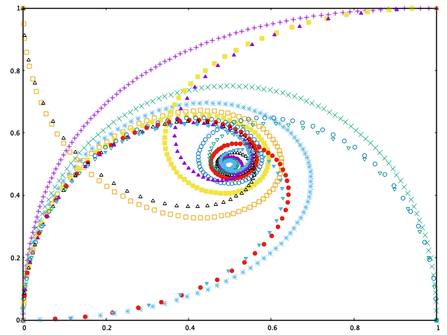

#Day 46: Bézier Curve
 
A Bézier curve is a parametric curve frequently used in computer graphics and related fields. Generalizations of Bézier curves to higher dimensions are called Bézier surfaces, of which the Bézier triangle is a special case.
 
In vector graphics, Bézier curves are used to model smooth curves that can be scaled indefinitely. "Paths", as they are commonly referred to in image manipulation programs, are combinations of linked Bézier curves. Paths are not bound by the limits of rasterized images and are intuitive to modify.
 
Bézier curves are also used in the time domain, particularly in animation, user interface design and smoothing cursor trajectory in eye gaze controlled interfaces.For example, a Bézier curve can be used to specify the velocity over time of an object such as an icon moving from A to B, rather than simply moving at a fixed number of pixels per step. When animators or interface designers talk about the "physics" or "feel" of an operation, they may be referring to the particular Bézier curve used to control the velocity over time of the move in question.
 
This also applies to robotics where the motion of a welding arm, for example, should be smooth to avoid unnecessary wear.
 
The mathematical basis for Bézier curves—the Bernstein polynomial—had been known since 1912, but the polynomials were not applied to graphics until some 50 years later, when they were widely publicised by the French engineer Pierre Bézier, who used them to design automobile bodies at Renault. The study of these curves was however first developed in 1959 by mathematician Paul de Casteljau using de Casteljau's algorithm, a numerically stable method to evaluate Bézier curves at Citroën, another French automaker.
 

